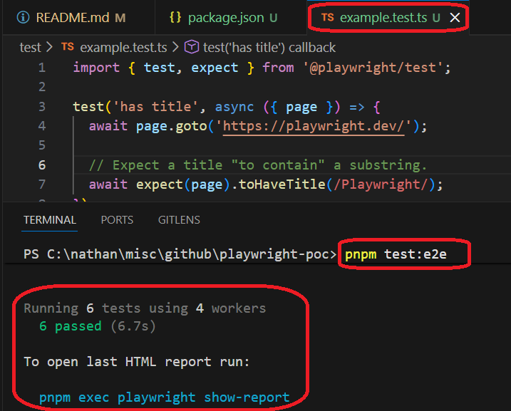
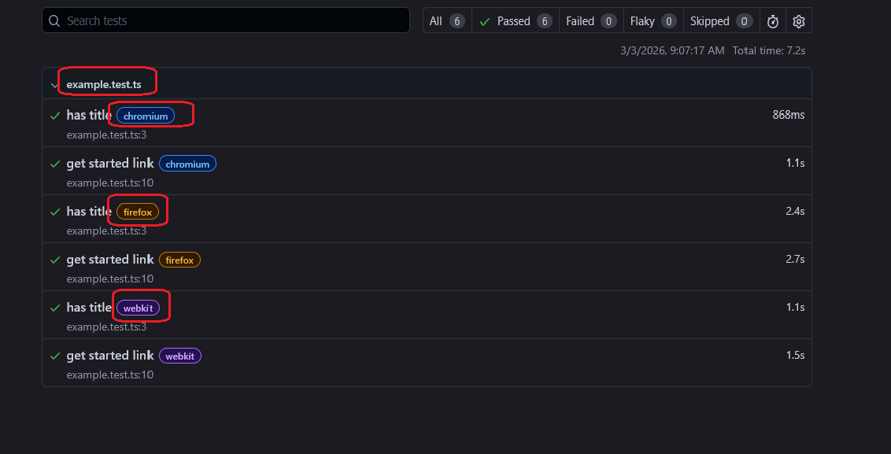
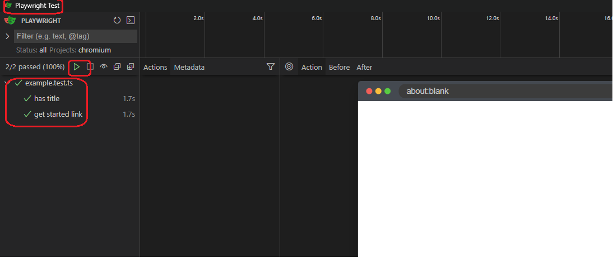
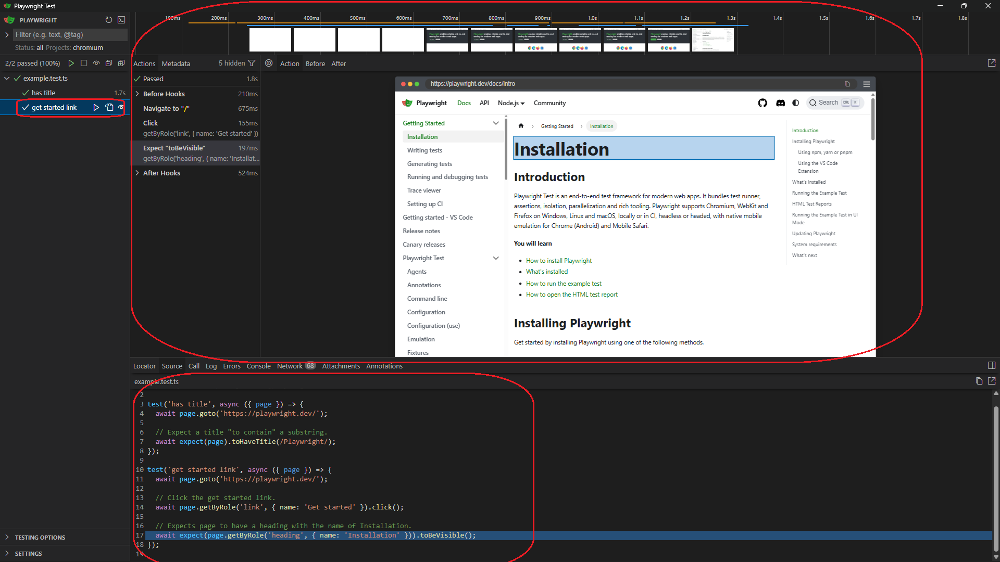
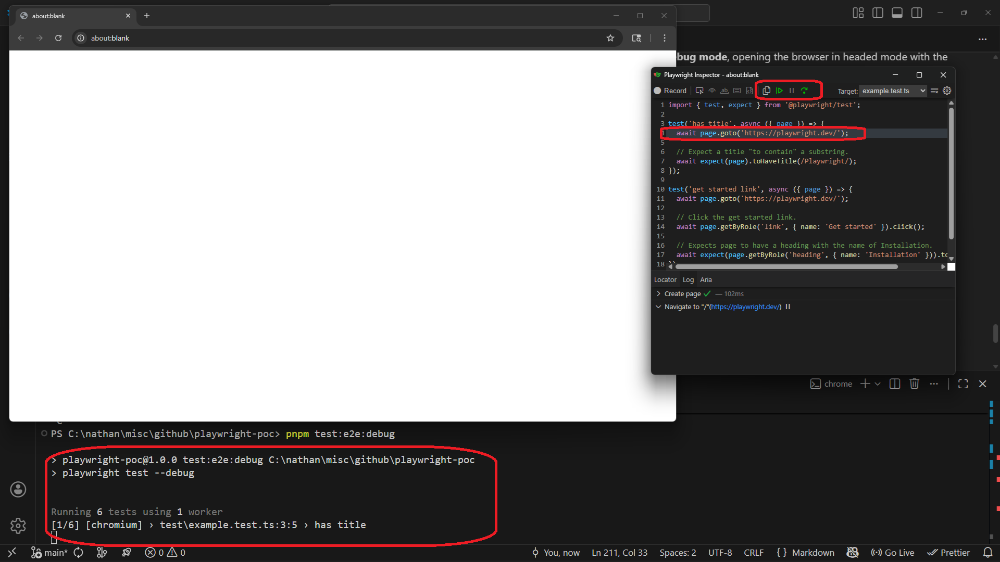

# Project Name

Simple playwright sample

## Project Description

A minimal Playwright project for absolute beginners (zero Playwright experience)

## Motivation

E2E tests are essential for real user flows like the post2video.com signup. Playwright is the recommended technology — but how do you get started?


## Key Takeaways

* **Kill the `sleep()` Command**: Never use manual timeouts again. Playwright’s **Web-First Assertions** automatically retry for up to 5 seconds, and **Actions** like `.click()` auto-wait up to 30 seconds with built-in "Actionability" checks (visible, stable, enabled).
* **Debug with "Time-Travel"**: Don't guess why a test failed. Use **UI Mode** or the **Trace Viewer** to hover over your code and see a full DOM snapshot, console logs, and network activity for every millisecond of the run.
* **Locate Like a Human**: Stop using fragile CSS selectors like `.btn-primary`. Use **User-Facing Locators** (e.g., `getByRole('button', { name: 'Submit' })`) to make tests resilient to design changes and accessible by default.


## Installation

```bash
pnpm create playwright
```

## Usage

```bash
pnpm exec playwright test                     # run all tests headless
pnpm exec playwright test --headed            # run with visible browser
pnpm exec playwright test --ui                # interactive UI mode
pnpm exec playwright test --trace on          # run with trace recording for debugging
pnpm exec playwright test --project=chromium  # run on Desktop Chrome only
pnpm exec playwright test --debug             # debug mode
pnpm exec playwright codegen                  # auto-generate tests by recording actions
```

You can also use the scripts in package.json

```json
"scripts": {
    "test:e2e": "playwright test",
    "test:e2e:ui": "playwright test --ui",
    "test:e2e:debug": "playwright test --debug",
    "test:e2e:report": "playwright show-report",
    "test:e2e:codegen": "playwright codegen"
  },

```

## Playwright Core Concepts

Here are the five core concepts you need to understand to use Playwright effectively:

### 1. Locators

Instead of fragile CSS selectors or XPaths (e.g., `.btn-primary`), Playwright prioritizes **user-facing selectors** like `getByRole('button', { name: 'Submit' })` or `getByText()`. This makes tests more resilient to design changes and ensures your app is accessible.

### 2. Web-First Assertions

Playwright’s **`expect()`** assertions (using matchers like `toBeVisible()`) auto-retry for a default of **5 seconds**, while **actions** (like `click()`) and **navigations** (like `goto()`) wait for up to **30 seconds**—ensuring the engine only proceeds once the state is correct without manual `sleep` commands.


### 3. Actionability

Before performing an action like `.click()` or `.type()`, Playwright performs a suite of **actionability checks**. It ensures the element is:

* **Attached** to the DOM.
* **Visible** and **Stable** (not moving).
* **Enabled** and not obscured by other elements.

### 4. Projects

You can define multiple **Projects** in a single configuration file. This allows you to run the same test suite across different viewports (Desktop vs. Mobile) and different browser engines (Chromium, Firefox, WebKit) simultaneously.

### 5. Trace Viewer

The Trace Viewer is a "time-travel" debugging tool. It records every action, providing a full **DOM snapshot**, console logs, and network activity for every step of the test. You can hover over a specific line of code and see exactly what the browser looked like at that millisecond.

---


### Exercises
- Test against playwright.dev: click "Get started", assert "Installation" heading . No CSS selectors, no waitForTimeout, no waitForSelector
- Add mobile project to config, run same test in both viewports
- Run with --trace on, inspect in Trace Viewer


## Technologies

* **Playwright** — For end-to-end testing and browser automation.
* **TypeScript** — Ensuring type-safe tests and better developer experience.
* **pnpm** — Managing dependencies and executing scripts efficiently in a monorepo context.

## Code Structure

Here are the most noticeable parts of the project structure:

### test folder : test
Here you put the test files 


### test file : example.test.ts
Here you write the tests

If you are familiar with puppeteer and vitest \ jest you will find it very familiar

```typescript
import { test, expect } from '@playwright/test';

test('has title', async ({ page }) => {
  await page.goto('https://playwright.dev/');

  // Expect a title "to contain" a substring.
  await expect(page).toHaveTitle(/Playwright/);
});

test('get started link', async ({ page }) => {
  await page.goto('https://playwright.dev/');

  // Click the get started link.
  await page.getByRole('link', { name: 'Get started' }).click();

  // Expects page to have a heading with the name of Installation.
  await expect(page.getByRole('heading', { name: 'Installation' })).toBeVisible();
});

```


### `playwright.config.ts`

Main config file.
Defines projects (desktop/mobile), timeouts, and test settings.

```typescript
import { defineConfig, devices } from '@playwright/test';

export default defineConfig({
  testDir: './test',
  /* Run tests in files in parallel */
  fullyParallel: true,
  /* Fail the build on CI if you accidentally left test.only in the source code. */
  forbidOnly: !!process.env.CI,
  /* Retry on CI only */
  retries: process.env.CI ? 2 : 0,
  /* Opt out of parallel tests on CI. */
  workers: process.env.CI ? 1 : undefined,
  /* Reporter to use. See https://playwright.dev/docs/test-reporters */
  reporter: 'html',
  /* Shared settings for all the projects below. See https://playwright.dev/docs/api/class-testoptions. */
  use: {
    /* Collect trace when retrying the failed test. See https://playwright.dev/docs/trace-viewer */
    trace: 'on-first-retry',
  },

  /* Configure projects for major browsers */
  projects: [
    {
      name: 'chromium',
      use: { ...devices['Desktop Chrome'] },
    },

    {
      name: 'firefox',
      use: { ...devices['Desktop Firefox'] },
    },

    {
      name: 'webkit',
      use: { ...devices['Desktop Safari'] },
    },

  ],

});

```

### `playwright-report/`

Auto-generated HTML report after running tests.
Open with:

```bash
pnpm test:e2e:report
```

Contains test results and traces.
Should be gitignored.


## Demo

### playwright test

```bash
pnpm test:e2e
```



**playwright-report**

```bash
pnpm test:e2e:report
```

Notice : chromium , firefox and webkit appear here because they are configured in projects under the config file



### playwright test --ui

```bash
pnpm test:e2e:ui
```

This launches an **interactive desktop dashboard** that allows you to run tests, "time-travel" through DOM snapshots of every step, and live-pick resilient locators while you write your code.





Notice here the second test is marked so we can see the browser for the second test




### playwright test --debug

```bash
pnpm test:e2e:debug
```

This runs your tests in **debug mode**, opening the browser in headed mode with the Playwright Inspector so you can step through the test, pause execution, inspect locators, and see what’s happening in real time.



## References
- [playwright.dev](https://playwright.dev/)
